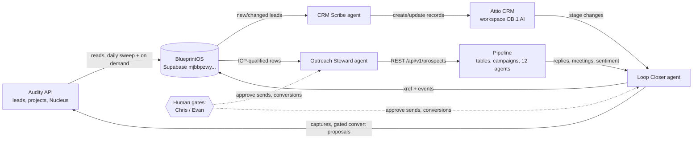

# PRD: OB.1 Revenue Loop (adjacent agents)

Project ID: OB1-INT-2606-001. Version 1.0.0. Author: Chief. Date: 2026-06-07.
Classification: OB.1 internal. Downstream consumers: Chief (orchestrator), Matt Vinall (Pipeline side), Cowork agent fleet, future n8n workers.

## 1. Executive summary

Problem: OB.1's revenue intelligence lives in three disconnected systems. Audity holds readiness-scored leads (53 today, 41 active unconverted) and active client work (7 engagements); Attio (workspace "OB.1 AI") is a greenfield CRM with zero lists; Pipeline (pipeline.help) runs LinkedIn/email outreach with 12 agents but receives no Audity intelligence. Every cross-system step today is a human swivel-chair.

Solution: a three-agent internal loop over BlueprintOS (the Supabase read model built 2026-06-07): the CRM Scribe materializes Audity leads and engagements into Attio; the Outreach Steward feeds ICP-qualified, readiness-scored prospects into Pipeline tables and campaigns; the Loop Closer routes Pipeline replies and Attio stage changes back into Audity (captures, gated conversions) and BlueprintOS. Humans approve all credit-spending and outbound-send actions.

Success metrics:

| KPI | Baseline (2026-06-07) | Target (90 days) |
|---|---|---|
| Lead-to-CRM latency (Audity lead visible in Attio) | manual, days or never | under 24h, automated |
| Readiness-scored prospects entering Pipeline campaigns per week | 0 | 25 or more |
| Manual sync touches per lead | est. 4 (read, re-key, score, route) | 1 (approval only) |
| Stale-client insights actioned within 48h | ad hoc | 100% routed to owner |
| Audit conversion cycle (qualified lead to Audity project) | untracked | tracked end to end with approval timestamps |

Timeline: Phase A (Attio schema + Scribe) week 1; Phase B (Pipeline feed) week 2-3; Phase C (Loop Closer + reporting) week 4; 20% buffer included per phase.
Resources: Chief on OB1AIRIG, one Pipeline seat ($99/mo) plus BYOK provider costs ($20-60/mo est.), Matt 2-4h for Pipeline workspace wiring, Chris approvals.
Top risks: (1) Audity has no webhooks in v1, mitigation: scheduled pulls (daily sweep exists, hourly during business hours optional); (2) Pipeline is private beta, mitigation: Matt owns the platform, pin CLI/MCP versions; (3) duplicate identities across systems, mitigation: BlueprintOS xref table keyed on normalized email+domain, Attio record_id stored on every row.

## 2. Problem definition

Current state: documented in OB-Nucleus STATUS.md. Audity reads/writes are agent-accessible (CLI, MCP server, BlueprintOS mirror). Attio: empty workspace, admin Chris. Pipeline: live product, hosted MCP (87 tools), CLI pipeline-gtm, REST ingestion, no OB.1 workspace connected yet.

Pain points: (1) readiness scores never reach outreach targeting; (2) no CRM record exists for 41 active leads; (3) stale-client insights (2 unread today) have no routing; (4) conversion decisions lack a queue with cost context; (5) engagement state (interviews, analysis) is invisible outside Audity.

Personas: Evan (CRO) needs a deal queue with readiness and cost context; Chloe (ops) needs CRM hygiene without data entry; Matt (CTO) needs clean prospect payloads into Pipeline; Chris needs approval gates and the weekly picture; Chief and fleet agents need deterministic interfaces.

Constraints: Audity v1 has no webhooks, no org tokens, PAT rate limits (reads 100/min, writes 20/min); Pipeline is LinkedIn-native (sends from a human seat); Attio MCP in this environment is read-heavy with record write tools (create-record, update-record, create-task, create-note) but list creation is dashboard/API work.

Out of scope for v1: autonomous credit-spending conversions (always human-gated); autonomous outbound sends (Pipeline campaign start is human-gated); Notion spine replacement (Notion remains system of record for engagement docs; Attio is the live pipeline surface); email-channel sending infrastructure (Pipeline BYOK handles it); any client-facing UI.

## 3. Solution architecture



Components: BlueprintOS adds three tables (revenue_xref, loop_events, conversion_queue). Agents are Claude tasks (Cowork scheduled or Chief-invoked) using: ob-nucleus CLI/MCP (Audity), Attio MCP tools (create-record, update-record, search-records, create-task), Pipeline hosted MCP or pipeline-gtm CLI (Matt provisions the key). All writes to external systems are idempotent upserts keyed by xref.

Stack rationale: reuse OB-Nucleus Python client and BlueprintOS (built, verified); Attio via its MCP (already connected to the org); Pipeline via its REST for ingestion (deterministic, cron-safe) and MCP for ad hoc agent work. No new infrastructure until Phase C reporting.

Security: tokens in OB1AIRIG user env per TOKEN_REGISTRY.md; Pipeline key added as PIPELINE_API_KEY; RLS stays no-policy (service role only); client names and emails are confidential business data, never in commit messages or public assets.

## 4. Functional requirements (condensed; one per statement)

FR-XRF-001 (P0). Identity cross-reference. As Chief, I maintain one identity row per company/person across Audity, Attio, Pipeline.
AC-001: Given a new Audity lead in BlueprintOS, when Scribe runs, then a revenue_xref row exists with audity_lead_id, normalized email, domain, and null attio_record_id replaced after CRM write.
AC-002: Given an existing xref match on email or domain, when Scribe runs, then no duplicate Attio record is created and the existing record is updated.

FR-CRM-001 (P0). Lead materialization to Attio. As Chloe, I want every active unconverted Audity lead as an Attio company+person record with readiness score, so the pipeline is visible in the CRM.
AC-003: Given an active unconverted lead, when Scribe runs, then an Attio company record carries attributes audity_lead_id, ai_readiness_score, composite_score, audity_status, source, synced_at.
AC-004: Given a lead with convertedToAuditId set, when Scribe runs, then the Attio record stage is set to Converted and no further outreach eligibility is granted.
AC-005: Given a test-rig lead (email domain example.com or businessName matching the exclusion list), when Scribe runs, then the lead is skipped and logged to loop_events with reason test_rig.

FR-CRM-002 (P1). Engagement mirroring. As Evan, I want the 7 active engagements as Attio deals with stage mapped from Audity project status (interviews to Discovery, analysis to Diagnostics), so client work and pipeline share one surface.
AC-006: Given an active client project in BlueprintOS, when Scribe runs, then an Attio deal exists linked to the company record with stage mapped per the table in Section 6.

FR-OUT-001 (P0). Pipeline feed. As Matt, I want ICP-qualified prospects pushed to a Pipeline table via POST /api/v1/prospects with readiness metadata, so Pipeline agents enrich and draft against real intelligence.
AC-007: Given leads with ai_readiness_score at or above 80 and no Attio stage of Converted or Do-Not-Contact, when Steward runs with --confirm, then prospects post to the configured Pipeline campaign and the xref stores pipeline_prospect_ref.
AC-008: Given Steward without --confirm, when it runs, then it outputs the exact payload and count as a dry run and posts nothing.

FR-OUT-002 (P1). Signal enrichment handoff. As the Pipeline Researcher, I receive Audity context (readiness score, survey highlights, insight flags) as table columns, so openers cite real evidence.
AC-009: Given a pushed prospect, when the payload is built, then it includes audity_readiness, audity_top_signal, and audity_lead_url fields.

FR-LOOP-001 (P0). Reply and meeting return path. As Chris, I want Pipeline replies classified MEETING or INTERESTED to create an Attio task and a Nucleus capture, so follow-ups never drop.
AC-010: Given a Pipeline conversation with sentiment MEETING, when Closer runs, then an Attio task is assigned to Evan with due date 24h and a Nucleus capture-note (confirmed) records the thread summary with the engagement projectId when one exists.

FR-LOOP-002 (P0). Gated conversion queue. As Chris, I want qualified outcomes queued with credit cost and one-tap approval, so conversions stay deliberate.
AC-011: Given a lead reaching Attio stage Audit-Ready, when Closer runs, then a conversion_queue row exists with lead id, readiness, cost 1000, credits remaining, and proposal text; no convert call fires without human confirmation recorded in approved_by.

FR-RPT-001 (P2). Weekly loop digest. As the team, we receive a Monday digest (extends read sweep) covering loop_events counts, queue state, and Coach-style deltas.
AC-012: Given the weekly run, when the digest builds, then it lands in verification/, the Drive folder, and (Phase C) Slack #revenue.

Error handling (all FRs): Audity 429 honored via client backoff; Attio MCP failures retry 3x with exponential backoff then log loop_events status=failed; Pipeline REST non-200 aborts the batch and surfaces the body; every agent run writes a loop_events row (run id, agent, counts, status).
Edge cases: email missing on lead (xref keys on domain+businessName hash); duplicate Cleveland Candy entries (xref dedupes on normalized name, flags for human merge); archived projects (excluded by sync scope); lead re-activation after Do-Not-Contact (requires human flag clear in Attio).

## 5. Non-functional requirements

Agent runs complete under 5 minutes per cycle at current volumes (53 leads, 7 engagements); all third-party rate limits respected with margin (max 10 Attio writes/run burst, Audity client backoff built-in); availability follows OB1AIRIG uptime (scheduled tasks) with every run idempotent so missed runs self-heal on next cycle; secrets only in user env and TOKEN_REGISTRY fingerprints; PII classification: business contact data (names, emails, phones) lives in Attio/BlueprintOS/Pipeline only, never in git, logs redact emails to first3...domain.

## 6. Data specifications

BlueprintOS additions (supabase/schema_v3.sql, to be authored at Phase A start):

```sql
revenue_xref(id uuid pk, audity_lead_id text unique, audity_project_id text,
  attio_company_id text, attio_deal_id text, pipeline_prospect_ref text,
  email_normalized text, domain text, display_name text,
  created_at timestamptz, updated_at timestamptz)
loop_events(id bigint identity pk, run_id uuid, agent text,
  action text, subject_ref text, status text, detail jsonb, created_at timestamptz)
conversion_queue(id bigint identity pk, audity_lead_id text, readiness numeric,
  credit_cost int, credits_remaining int, proposal text, status text default 'pending',
  approved_by text, approved_at timestamptz, executed_at timestamptz, result jsonb)
```

Attio schema (greenfield; created via dashboard or API by Chloe/Chief at Phase A):
Companies (standard object) custom attributes: audity_lead_id (text), ai_readiness_score (number), audity_status (select: pending, completed, converted), audity_source (text), synced_at (timestamp).
Lists: "OB.1 Sales Pipeline" (parent: companies; stages: New, Scored, Outreach, Engaged, Audit-Ready, Converted, Do-Not-Contact) and "OB.1 Engagements" (parent: companies; stages: Discovery, Diagnostics, Blueprint, Architecture, Delivered) mapping Audity status interviews to Discovery and analysis to Diagnostics.

Pipeline payload (POST /api/v1/prospects): campaign_id (Matt provisions), prospects[] each {linkedin_url?, first_name, last_name?, company_name, email?, custom: {audity_readiness, audity_top_signal, audity_lead_url}}. Contract per pipeline.help/developers; verify field names against live API before Phase B (probe-first rule).

## 7. Test specifications (strategy)

Unit: xref normalization (case, whitespace, plus-addressing), stage mapping table, exclusion rules (TC-XRF-001..004, TC-CRM-001..003). Integration (staging): Scribe dry-run against live BlueprintOS with Attio writes mocked, then 3-record live canary batch approved by Chloe; Steward dry-run payload diffed against Pipeline OpenAPI; Closer simulated with fixture conversations. Security: secret-scan CI on every commit (pattern from OB-Nucleus); no payload logging above redaction level. Regression: OB-Nucleus unit suite stays green; read sweep unaffected. Performance: full cycle under 5 min, measured in loop_events.

## 8. Deployment

Environments: dev = OB1AIRIG repo checkout; prod = same machine, scheduled tasks (pattern proven with OB1 Audity Daily Sweep). Schedules: Scribe daily 07:15 (after sweep), Steward weekdays 08:00 (dry-run output to approval channel until Chris flips OBN_STEWARD_AUTOPUSH=true), Closer hourly 08:00-18:00 weekdays. New env vars: PIPELINE_API_KEY, ATTIO_WORKSPACE confirmation (MCP already org-connected). Rollback: agents are stateless over idempotent upserts; disable = remove scheduled task; data rollback = soft (xref rows retained, Attio records archived not deleted). Health: each run appends loop_events; digest flags any agent silent for 48h. Release checklist: schema_v3 applied, Attio lists created, Pipeline campaign exists, canary batch verified, secret scan clean, STATUS.md updated.

## 9. Handoff matrix

| From → To | Trigger | Deliverables | Acceptance | Escalation |
|---|---|---|---|---|
| Chief → Chris | This PRD v1.0.0 | PRD, blocking questions below | Approval or edits | Chris |
| Chief → Matt | PRD approved | Pipeline needs: workspace key, campaign_id, prospect field mapping | Key in env, test POST returns 200 | Chris |
| Chief → Chloe | PRD approved | Attio schema spec (Section 6) | Lists + attributes exist, 3-record canary visible | Chris |
| Chief → fleet | Phase A code merged | Scribe/Steward/Closer task prompts + runbooks | Dry runs green 3 consecutive days | Chief |
| Closer → Chris/Evan | conversion_queue row | Proposal with cost and credits | approved_by set | Chris |

## 10. Appendices

Blocking questions (answers required before Phase B): (1) Pipeline workspace and API key owner: Matt's existing org workspace or a new OB.1 workspace? (2) Outreach seat: whose LinkedIn seat sends (affects compliance and voice)? (3) Readiness threshold 80 for auto-feed: confirm or adjust. (4) Attio stage names above: confirm against Chloe's process before list creation.
Glossary: readiness score (Audity AI readiness 0-100), conversion (lead to Audity project, 1000 credits), xref (cross-system identity row), gated (dry-run default, human confirm to execute).
References: knowledge/ACTIVATION_BRIEF.md, docs/AUDITY_CONNECTOR_QUALIFICATION.md, pipeline.help/developers, TOKEN_REGISTRY.md, STATUS.md.
Revision history: 1.0.0 (2026-06-07, Chief) initial.
